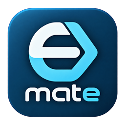
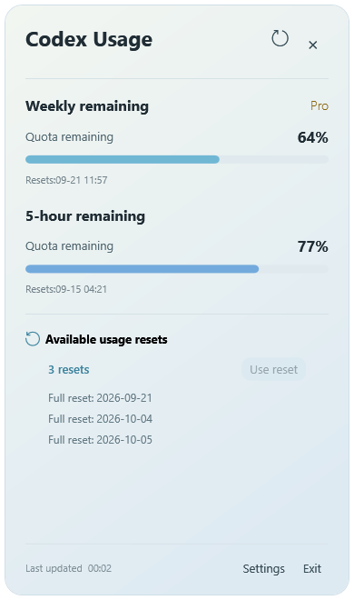
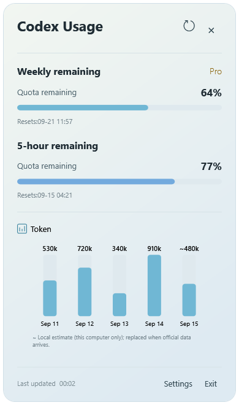
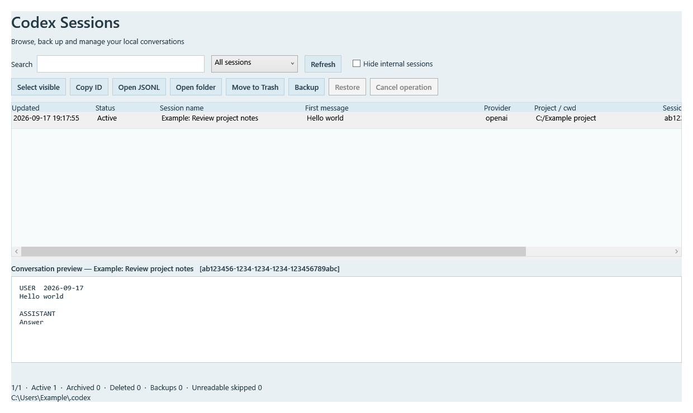
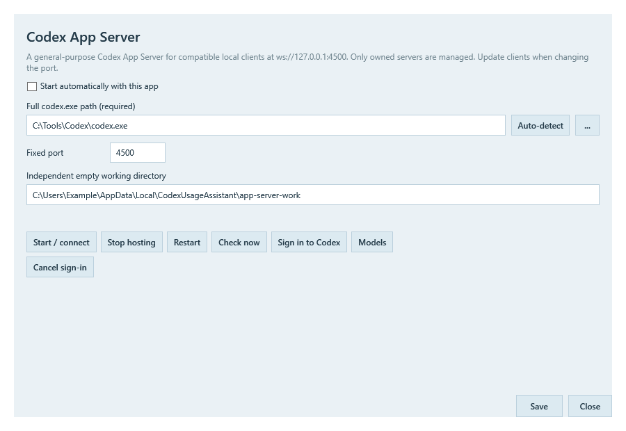

<p align="center">
  
</p>

# Codex EzMate

**English** · [繁體中文](README.zh-Hant.md) · [简体中文](README.zh-Hans.md)

A Windows companion for Codex: check remaining usage, manage local conversations, and host App Server in the background.

**Current source version: 1.21.3** · Windows x64 · .NET 8 / WPF · Traditional Chinese / Simplified Chinese / English

[Download](https://github.com/lkamhk/CodexEzMate/releases) · [Report an issue](https://github.com/lkamhk/CodexEzMate/issues)

**Current releases require manual updates. Automatic application updates are not enabled.**

> **Goal monitoring is available for experimental testing — feedback is welcome!** It sends an automatic continuation message to the original conversation. Processing that message and continuing the Goal consume tokens and Codex usage quota. Start with non-critical work; recovery after real quota exhaustion still needs live verification.

This is a third-party project, not an official OpenAI product.

## Screenshots

These screenshots show the English interface with example usage, conversations, and paths, rather than real account data. Click an image to view it at full size.

| Usage overview and available resets | Daily token activity |
| :---: | :---: |
| [](assets/screenshots/usage-overview-en.png) | [](assets/screenshots/token-activity-en.png) |

## Features

| Feature | Description |
| --- | --- |
| Usage overview | View remaining 5-hour and weekly quotas, reset times, and your account plan. |
| System tray and floating widget | Use either or both. The tray icon can display the remaining percentage, falling back to weekly quota when 5-hour data is unavailable. |
| Reset / Token / Credit | Hover to reveal navigation arrows. View reset expiry dates, daily token bars, and credit information. |
| Use a reset | Consume one reset after confirmation, prioritizing the earliest-expiring valid item in the returned details, then refresh usage. |
| Session Browser | Search and preview local conversations, copy IDs, back up, move to Trash, and restore. Internal sessions can be hidden. |
| Goal monitoring | **Experimental — available for testing.** Resume selected usage-limited Goals in the original Codex Desktop conversation. Sends a continuation message and consumes tokens and usage quota. |
| Server hosting | Start or reuse a local Codex App Server, with sign-in, connection status, restart controls, and recovery after unexpected exits. |
| Global shortcuts | Assign shortcuts to open Session Browser, Goal monitoring, Server host, usage details, settings, and other windows. |
| Usage refresh and preferences | Scheduled and event-triggered usage refresh, proxy settings, and three interface languages. Refreshing usage is separate from updating the application. |

## Installation and first use

1. Download an available installer, `Codex-EzMate-<version>-Setup.exe`, or portable package, `Codex-EzMate-win-x64.zip`, from [Releases](https://github.com/lkamhk/CodexEzMate/releases). If no package is available yet, follow the source instructions below.
2. The installer defaults to `%LOCALAPPDATA%\Programs\Codex EzMate` for the current user, creates a Start menu shortcut, and offers an optional desktop shortcut. For the portable edition, extract the **entire ZIP** to a writable folder and launch the top-level `CodexEzMate.exe`. Keep the `app/` folder in place for either edition.
3. Run under the same Windows account where Codex is installed and signed in. The package does not include `codex.exe`; EzMate attempts to detect its path, or you can set it manually.
4. Right-click the tray icon and open **Server host**. Check the Codex path and connection status; use **Sign in to Codex** if needed.
5. Left-click the tray icon to view usage details. Open **Settings** from the right-click menu to change the data source, refresh interval, language, and display mode.

The DOM/web data source requires Microsoft Edge WebView2 Runtime.

### Data sources and usage

Under **Settings → Basic settings**, choose:

- **App Server with DOM fallback** — the default.
- **App Server only**.
- **DOM/web only** — shows **Sign in / Get usage** in the right-click menu.

Available information depends on the Codex version, account, and fields returned by the backend. Missing data appears as “—” or an explanatory message; it does not mean usage is zero. App Server and the DOM source may be signed in to different accounts, so check which account you are using.

The token chart shows recent daily records. When official data does not yet include today, local conversation token records may provide an estimate marked with `~`. This covers records on this computer only and is not the official account-wide total.

**Use reset** requires App Server to return an available reset. Confirming the action consumes one reset. Credit values are displayed as returned by the backend, without converting them into currency or tokens.

### Global shortcuts

Open **Keyboard shortcuts** from the right-click menu, select modifiers and a key, then save. Changes take effect immediately.

- Use Ctrl, Alt, or Win with a letter, digit, or F1–F11. Shift can be added.
- All shortcuts are unassigned by default. For example, you can assign `Ctrl + Alt + S` to Session Browser.
- Disable all shortcuts while keeping their assignments, or choose **Unassigned** to clear one.
- Duplicate or unavailable combinations produce an error. EzMate must remain running for its shortcuts to work.

### Session Browser

[](assets/screenshots/session-browser-en.png)

Choose **Open Session Browser** from the right-click menu. Search conversations, preview messages, copy IDs, back up, move sessions to Trash, and restore them. Hiding internal sessions only filters the list; it does not delete anything.

The interface immediately follows the main app's language. Changing languages does not rewrite conversation names or messages. Opening the browser again brings the same WPF window to the foreground. While a backup, move, or restore is running, closing the browser or exiting EzMate is blocked. You can cancel the remaining operations and exit once the current file has been handled safely. Exiting EzMate also closes Session Browser.

Previews have size and message-count limits. Use **Open JSONL** to view the full record.

### Goal monitoring

> **Available for experimental testing — feedback is welcome!** The original Codex Desktop can remain open or minimized while EzMate requests continuation in the same conversation.

**Token and quota usage:** This feature sends an automatic continuation message to the original conversation. Processing the message and subsequent Goal execution consume tokens and Codex usage quota. Enable it only for conversations you want to continue.

1. Keep Codex Desktop open, then open **Goal monitoring** from the tray menu and scan local conversations.
2. Select the conversations you want to monitor and choose **Start monitoring**. Automatic recovery targets only selected Goals stopped by quota exhaustion, after App Server reports quota is available.
3. To try it with a non-critical, manually paused Desktop Goal, select it and choose **Continue selected paused Goal**.
4. Check progress and respond to approval or input requests in the original Desktop conversation. EzMate distinguishes queued messages from confirmed execution and avoids automatically resending uncertain requests after disconnection or restart.

Use **Stop monitoring** to stop taking on new recoveries. **Cancel recovery / pause continuation** handles an outstanding EzMate recovery and pauses further Goal continuation; stop an already running turn in the original Desktop. Exiting EzMate leaves Desktop work running.

**Tested:** continuation in the original Desktop, automatic continuation across turns, preservation of existing Goal usage, and operation while minimized with user-confirmed absence of foreground interference. **Still awaiting live verification:** recovery after actual quota exhaustion, including normal resets, manually redeemed resets, and early quota restoration. CLI and VS Code compatibility is not yet verified. Avoid editing or resuming the same Goal simultaneously in multiple clients.

Please [report feedback or problems](https://github.com/lkamhk/CodexEzMate/issues) with your EzMate and Codex versions, Goal status, steps to reproduce, and expected versus actual behavior. Remove account details, credentials, and private conversation content before sharing logs or screenshots.

### Server hosting

[](assets/screenshots/server-host-en.png)

The default endpoint is `ws://127.0.0.1:4500`, for compatible clients on the same computer. The server runs in the background without an extra console window and uses a separate working folder.

- Reuses an existing server that completes the protocol handshake. Reports an error if another service occupies the port.
- Manages only processes it starts. Exiting EzMate leaves reused external servers running.
- Restarts its own server after unexpected exits, retrying after 2, 5, 15, 30, and 60 seconds, then every 60 seconds.
- Uses Codex's saved authentication. You do not need to enter an API key into EzMate.

The separate working folder avoids inheriting another project's context. **It does not enable a “no conversation history” mode**; the connecting client determines whether to create an ephemeral thread.

**Suggested companion: [Saladict EzMate](https://github.com/lkamhk/saladict-ezmate-) for using Codex for translation.** If you use its Codex App Server integration, set the endpoint to `ws://127.0.0.1:4500` and let Codex EzMate host the server in the background, without opening a terminal each time. See that project's README for installation and configuration.

### Application updates

**Current releases do not automatically check for, download, or install newer application versions.** Download updates manually from [GitHub Releases](https://github.com/lkamhk/CodexEzMate/releases).

Exit EzMate normally before updating. For the installer edition, run the new Setup file. For the portable edition, preserve your settings and conversation backups before replacing application files.

Scheduled usage refresh and server-notification refresh remain available; disabling application updates does not affect them.

## Running from source

Requires Windows x64, the .NET 8 SDK, and network access to restore NuGet packages. Session Browser builds with the main application. Python, Nuitka, and C++ build tools are not required.

```powershell
git clone https://github.com/lkamhk/CodexEzMate.git
cd CodexEzMate
dotnet run --project src/CodexUsageAssistant.App/CodexUsageAssistant.App.csproj -c Debug
```

This restores dependencies, builds, and starts the Debug version. Exit any running Debug instance before rebuilding. To build without launching:

```powershell
dotnet build src/CodexUsageAssistant.App/CodexUsageAssistant.App.csproj -c Debug
```

Run tests:

```powershell
dotnet test tests/CodexUsageAssistant.Tests/CodexUsageAssistant.Tests.csproj -c Debug
```

## Reference projects

- [CodexMeter](https://github.com/raycalrui/CodexMeter)
- [CodexQuotaTray](https://github.com/SYD-Official/CodexQuotaTray)

## Third-party resources

Some interface icons use Microsoft Fluent UI System Icons. See the [Fluent UI license](src/CodexUsageAssistant.App/Assets/fluent/LICENSE.txt). Other dependencies are subject to their respective licenses.
