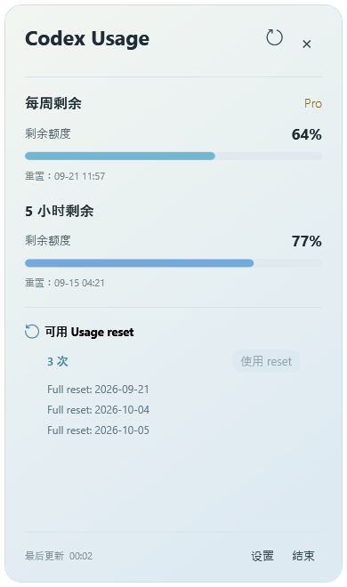
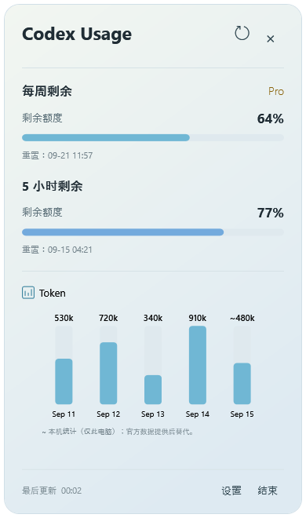
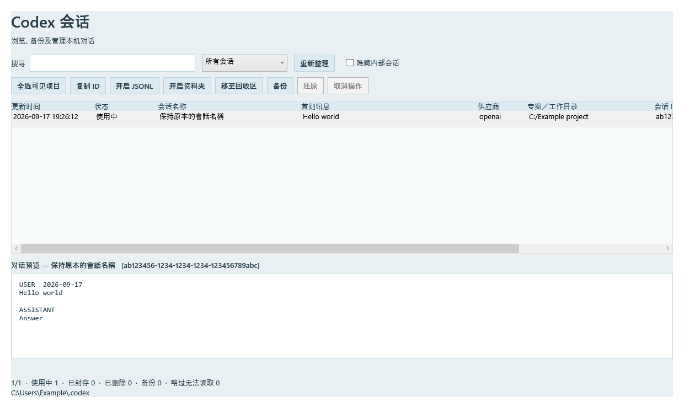
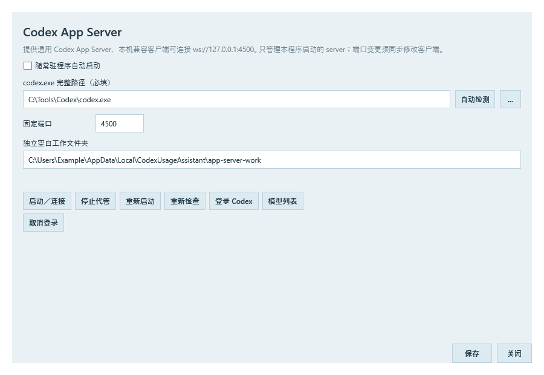

<p align="center">
  
</p>

# Codex EzMate

[English](README.md) · [繁體中文](README.zh-Hant.md) · **简体中文**

Windows 上的 Codex 常驻助手：查看剩余用量、管理本机会话及代管 App Server。

**当前源代码版本：1.21.3** · Windows x64 · .NET 8 / WPF · 繁体中文／简体中文／English

[下载版本](https://github.com/lkamhk/CodexEzMate/releases) · [反馈问题](https://github.com/lkamhk/CodexEzMate/issues)

**当前发布的是手动更新版本，不启用程序自动更新。**

> **Goal 监控现已开放测试使用，欢迎反馈！** 此功能会向原对话发送自动继续消息，处理消息及后续执行会消耗 token 和 Codex 用量额度。请先用非重要工作测试；真正额度耗尽后的恢复仍待实测。

本项目为第三方工具，并非 OpenAI 官方产品。

## 界面预览

以下图片使用示例用量、会话及路径展示界面，不代表实际账户数据；可点击图片查看原尺寸。

| 用量概览与可用 reset | 每日 Token 图表 |
| :---: | :---: |
| [](assets/screenshots/usage-overview-zh-hans.png) | [](assets/screenshots/token-activity-zh-hans.png) |

## 功能

| 功能 | 说明 |
| --- | --- |
| 用量概览 | 查看 5 小时／每周剩余额度、重置时间及账户方案。 |
| 系统托盘与悬浮球 | 可单独或同时显示；系统托盘图标可直接显示剩余百分比，缺少 5 小时数据时改用每周额度。 |
| Reset／Token／Credit | 鼠标移入显示切换箭头；查看 reset 到期日、每日 Token 柱状图及 Credit 数据。 |
| 使用 reset | 确认后使用一次 reset，优先选择明细中最快到期的有效项目，再重新取得额度。 |
| Session Browser | 搜索及预览本机会话、复制 ID、备份、移至回收区及还原；可隐藏内部会话。 |
| Goal 监控 | **实验功能，开放测试。** 在原 Codex Desktop 对话恢复已勾选且因额度停止的 Goal；会发送继续消息并消耗 token 和用量额度。 |
| Server 代管 | 后台启动或重用本机 Codex App Server，提供登录、连接状态、重新启动及意外退出后恢复。 |
| 全局快捷键 | 自定义快捷键开启 Session Browser、Goal 监控、Server 代管、详细用量及设置等窗口。 |
| 用量更新与偏好设置 | 支持定时／事件触发刷新用量、Proxy 及三语界面；用量刷新与程序升级是不同功能。 |

## 安装与首次使用

1. 从 [Releases](https://github.com/lkamhk/CodexEzMate/releases) 选择已发布的安装版 `Codex-EzMate-<版本>-Setup.exe` 或 portable 版 `Codex-EzMate-win-x64.zip`。若尚未有可下载文件，可按下方步骤从源代码执行。
2. 安装版默认安装至当前用户的 `%LOCALAPPDATA%\Programs\Codex EzMate`，建立开始菜单快捷方式，可选择建立桌面快捷方式；portable 版则将**整个 ZIP** 解压至可写入的文件夹，再启动外层 `CodexEzMate.exe`。两者均需保留 `app/` 文件夹。
3. 使用已安装并登录 Codex 的同一 Windows 账户执行。软件包不包含 `codex.exe`；程序会尝试检测路径，亦可在设置中手动指定。
4. 从系统托盘右键开启「Server 代管」，确认 Codex 路径及连接状态；需要登录时使用「登录 Codex」。
5. 左键按系统托盘图标查看详细用量；右键 →「设置」可更改数据来源、更新频率、语言及显示方式。

使用 DOM 网页数据来源时，需要 Microsoft Edge WebView2 Runtime。


### 数据来源与用量显示

「设置 → 基本设置」可选择：

- **App Server 优先，DOM 后备**：默认选项。
- **只使用 App Server**。
- **只使用 DOM／网页**：右键菜单会显示「登录／取得额度」。

显示内容取决于 Codex 版本、账户及后端提供的字段。未提供的数据会显示「—」或相应提示，不代表用量为零。App Server 与 DOM 可能登录不同账户，请核对当前使用的账户。

Token 图表显示最近的每日记录；官方数据未包含今日时，可用本机会话的 Token 记录补充估算，并以 `~` 标示。这只涵盖此电脑记录，不等同账户官方总用量。

「使用 reset」需要 App Server 提供可用项目；按下并确认会实际消耗一次 reset。Credit 依后端原值显示，不推算货币或 Token 汇率。

### 全局快捷键

右键 →「快捷键设置」，选择修饰键及按键后保存，立即生效。

- 支持 Ctrl／Alt／Win 配合字母、数字或 F1–F11，可额外加入 Shift。
- 默认全部未指定；例如可自行设置 `Ctrl + Alt + S` 开启 Session Browser。
- 可停用全部快捷键并保留组合，或选「未设置」清除个别组合。
- 重复或被占用的组合会提示错误；程序必须保持运行，快捷键才有效。

### Session Browser

[](assets/screenshots/session-browser-zh-hans.png)

右键 →「开启会话浏览器」。可搜索会话、预览内容、复制 ID、备份、删除至回收区及还原。勾选隐藏内部会话只会筛选清单，不会删除数据。

界面语言即时跟随主程序，更改语言不会改写会话名称或讯息。重复开启会唤回同一个 WPF 窗口。备份／移至回收区／还原期间会阻止关闭浏览器及退出 EzMate；可先取消剩余操作，等当前文件安全处理完毕后退出。退出 EzMate 时会一并关闭浏览器。

预览有大小及消息数量上限，完整内容可使用「开启 JSONL」查看。

### Goal 监控

> **现已开放测试使用，欢迎反馈！** Codex Desktop 可以保持开启或最小化，由 EzMate 在原对话请求继续工作。

**Token 及额度使用：** 此功能会向原对话发送一条自动继续消息。处理该消息及后续 Goal 执行会消耗 token 和 Codex 用量额度，请只勾选你希望继续执行的对话。

1. 保持 Codex Desktop 开启，从系统托盘菜单打开「Goal 监控」，扫描本机对话。
2. 勾选要监控的对话，点击「开始监控」。自动恢复仅针对已勾选、因额度耗尽而停止的 Goal，并先由 App Server 确认额度可用。
3. 如想先用非重要、人工暂停的 Desktop Goal 测试，选中后点击「继续所选已暂停 Goal」。
4. 在原 Desktop 对话查看进度、处理批准及输入请求。EzMate 会区分已排队与已确认执行；断线或重启后，结果不明的请求不会自动重发。

「停止监控」会停止接收新的恢复工作。「取消恢复／暂停继续」处理尚待确认的 EzMate 恢复，并暂停 Goal 后续继续；已开始的回合请在原 Desktop 停止。退出 EzMate 不会停止原 Desktop 的工作。

**已测试：** 原 Desktop 对话继续、跨回合自动执行、保留已有 Goal 用量，以及最小化时执行且由用户确认未干扰前台操作。**仍待真正限额场景验证：** 额度耗尽后恢复，包括正常重置、手动使用 reset 及官方提前恢复额度。CLI 及 VS Code 兼容性尚未完成验证；请避免在不同客户端同时修改或恢复同一 Goal。

欢迎[反馈问题或提供意见](https://github.com/lkamhk/CodexEzMate/issues)，附上 EzMate／Codex 版本、Goal 状态、复现步骤，以及预期与实际结果。分享日志或截图前，请移除账户信息、凭证及私人对话内容。

### Server 代管

[](assets/screenshots/server-host-zh-hans.png)

默认端点为 `ws://127.0.0.1:4500`，供本机相容 App Server 客户端使用。Server 在后台运行，不额外开启 console，并使用独立工作文件夹。

- 已有可正常握手的 Server 时直接重用；端口被其他服务占用时显示错误。
- 只管理自身启动的程序，退出时不停止重用的外部 Server。
- 自身 Server 意外退出后，以 2、5、15、30、60 秒间隔重试，之后维持 60 秒。
- 沿用 Codex 自己保存的登录认证，不需要在 EzMate 填写 API Key。

独立工作文件夹用于避免继承其他项目的上下文，**不代表启用「不保存对话」**；是否建立 ephemeral thread 由连接客户端决定。

**实用搭配：把codex用作翻译 可参考项目 [Saladict EzMate](https://github.com/lkamhk/saladict-ezmate-)。** 若使用其 Codex App Server 接入方式，可将连接位址设为 `ws://127.0.0.1:4500`，由 Codex EzMate 在后台代管 Server，无需每次手动开启终端。安装及设置方式请参阅该项目的 README。

### 程序更新

**当前发布版本不启用自动检查、下载或安装新版程序。** 请到 [GitHub Releases](https://github.com/lkamhk/CodexEzMate/releases) 手动下载新版。

更新前先正常结束 EzMate。安装版可执行新版 Setup；portable 版请先保留原有设置及会话备份，再更换程序文件。

用量的定时更新及 Server 通知更新仍可使用，不受程序自动更新停用影响。

## 从源代码执行

需要 Windows x64、.NET 8 SDK，以及可还原 NuGet 软件包的网络环境。Session Browser 随主程序一同编译，无需 Python、Nuitka 或 C++ 编译工具。

```powershell
git clone https://github.com/lkamhk/CodexEzMate.git
cd CodexEzMate
dotnet run --project src/CodexUsageAssistant.App/CodexUsageAssistant.App.csproj -c Debug
```

上述命令会还原依赖、编译并启动 Debug 版本。重新编译前请先结束旧 Debug 程序。只编译、不启动界面：

```powershell
dotnet build src/CodexUsageAssistant.App/CodexUsageAssistant.App.csproj -c Debug
```

执行测试：

```powershell
dotnet test tests/CodexUsageAssistant.Tests/CodexUsageAssistant.Tests.csproj -c Debug
```

## 参考项目

- [CodexMeter](https://github.com/raycalrui/CodexMeter)
- [CodexQuotaTray](https://github.com/SYD-Official/CodexQuotaTray)

## 第三方资源

部分界面图标使用 Microsoft Fluent UI System Icons，相关授权见 [Fluent UI LICENSE](src/CodexUsageAssistant.App/Assets/fluent/LICENSE.txt)。其他依赖的授权以各软件包随附文件为准。
