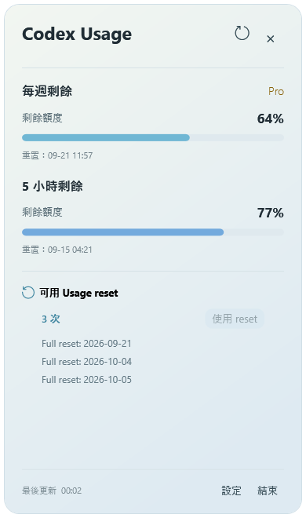
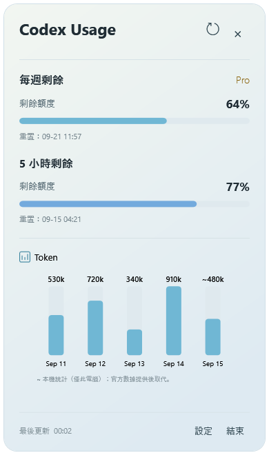
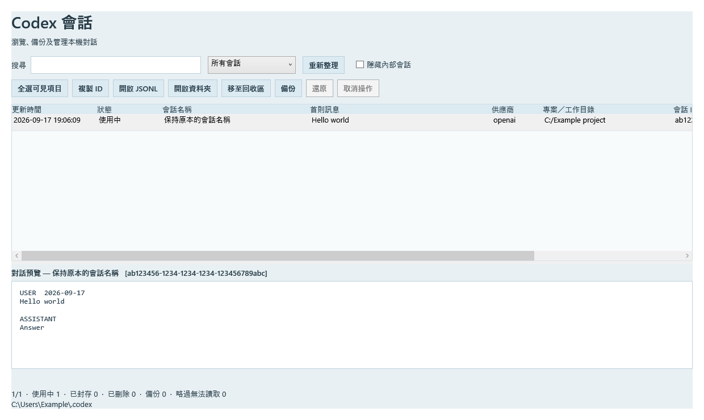
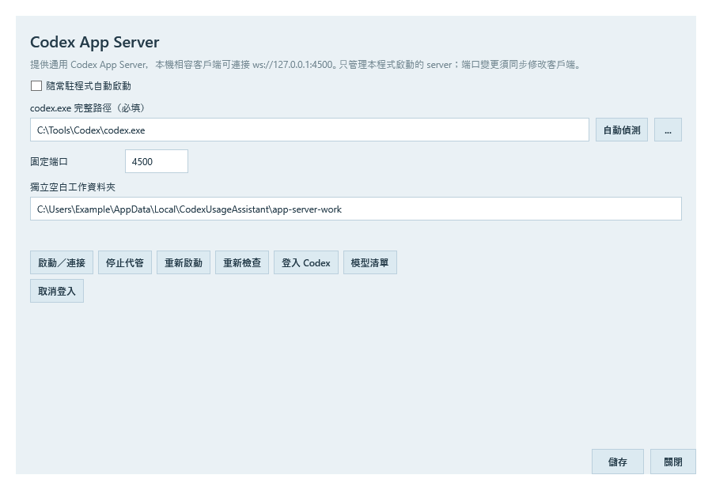

<p align="center">
  
</p>

# Codex EzMate

[English](README.md) · **繁體中文** · [简体中文](README.zh-Hans.md)

Windows 上的 Codex 常駐助手：查看剩餘用量、管理本機會話及代管 App Server。

**目前原始碼版本：1.21.3** · Windows x64 · .NET 8 / WPF · 繁體中文／簡體中文／English

[下載版本](https://github.com/lkamhk/CodexEzMate/releases) · [回報問題](https://github.com/lkamhk/CodexEzMate/issues)

**目前發佈的是手動更新版本，不啟用程式自動更新。**

> **Goal 監控現已開放測試使用，歡迎回饋！** 此功能會向原對話發送自動續跑訊息，處理訊息及後續執行會消耗 token 和 Codex 用量額度。請先以非重要工作測試；真正額度耗盡後的恢復仍待實測。

本專案為第三方工具，並非 OpenAI 官方產品。

## 介面預覽

以下圖片使用示例用量、會話及路徑展示介面，不代表實際帳戶資料；可點擊圖片查看原尺寸。

| 用量概覽與可用 reset | 每日 Token 圖表 |
| :---: | :---: |
| [](assets/screenshots/usage-overview.png) | [](assets/screenshots/token-activity.png) |

## 功能

| 功能 | 說明 |
| --- | --- |
| 用量概覽 | 查看 5 小時／每週剩餘額度、重置時間及帳戶方案。 |
| 系統匣與浮游球 | 可單獨或同時顯示；系統匣圖示可直接顯示剩餘百分比，缺少 5 小時資料時改用每週額度。 |
| Reset／Token／Credit | 滑鼠移入顯示切換箭咀；查看 reset 到期日、每日 Token 直柱圖及 Credit 資料。 |
| 使用 reset | 確認後使用一次 reset，優先選擇明細中最快到期的有效項目，再重新取得額度。 |
| Session Browser | 搜尋及預覽本機會話、複製 ID、備份、移至回收區及還原；可隱藏內部會話。 |
| Goal 監控 | **實驗功能，開放測試。** 在原 Codex Desktop 對話恢復已勾選且因額度停止的 Goal；會發送續跑訊息並消耗 token 和用量額度。 |
| Server 代管 | 背景啟動或重用本機 Codex App Server，提供登入、連線狀態、重新啟動及意外退出後恢復。 |
| 全域快捷鍵 | 自訂快捷鍵開啟 Session Browser、Goal 監控、Server 代管、詳細用量及設定等視窗。 |
| 用量更新與偏好設定 | 支援定時／事件觸發重新整理用量、Proxy 及三語介面；用量重新整理與程式升版是不同功能。 |

## 安裝與首次使用

1. 從 [Releases](https://github.com/lkamhk/CodexEzMate/releases) 選擇已發佈的安裝版 `Codex-EzMate-<版本>-Setup.exe` 或 portable 版 `Codex-EzMate-win-x64.zip`。若尚未有下載檔，可按下方步驟從原始碼執行。
2. 安裝版預設安裝至目前使用者的 `%LOCALAPPDATA%\Programs\Codex EzMate`，建立開始選單捷徑，可選擇建立桌面捷徑；portable 版則將**整個 ZIP** 解壓至可寫入的資料夾，再啟動外層 `CodexEzMate.exe`。兩者均需保留 `app/` 資料夾。
3. 使用已安裝並登入 Codex 的同一 Windows 帳戶執行。套件不包含 `codex.exe`；程式會嘗試偵測路徑，亦可在設定中手動指定。
4. 從系統匣右鍵開啟「Server 代管」，確認 Codex 路徑及連線狀態；需要登入時使用「登入 Codex」。
5. 左鍵按系統匣圖示查看詳細用量；右鍵 →「設定」可更改資料來源、更新頻率、語言及顯示方式。

使用 DOM 網頁資料來源時，需要 Microsoft Edge WebView2 Runtime。


### 資料來源與用量顯示

「設定 → 基本設定」可選擇：

- **App Server 優先，DOM 後備**：預設選項。
- **只使用 App Server**。
- **只使用 DOM／網頁**：右鍵選單會顯示「登入／取得額度」。

顯示內容取決於 Codex 版本、帳戶及後端提供的欄位。未提供的資料會顯示「—」或相應提示，不代表用量為零。App Server 與 DOM 可能登入不同帳戶，請核對目前使用的帳戶。

Token 圖表顯示最近的每日記錄；官方資料未包含今日時，可用本機會話的 Token 記錄補充估算，並以 `~` 標示。這只涵蓋此電腦記錄，不等同帳戶官方總用量。

「使用 reset」需要 App Server 提供可用項目；按下並確認會實際消耗一次 reset。Credit 依後端原值顯示，不推算貨幣或 Token 匯率。

### 全域快捷鍵

右鍵 →「快捷鍵設定」，選擇修飾鍵及按鍵後儲存，立即生效。

- 支援 Ctrl／Alt／Win 配合字母、數字或 F1–F11，可額外加入 Shift。
- 預設全部未指定；例如可自行設定 `Ctrl + Alt + S` 開啟 Session Browser。
- 可停用全部快捷鍵並保留組合，或選「未設定」清除個別組合。
- 重複或被佔用的組合會提示錯誤；程式必須保持運行，快捷鍵才有效。

### Session Browser

[](assets/screenshots/session-browser.png)

右鍵 →「開啟會話瀏覽器」。可搜尋會話、預覽內容、複製 ID、備份、刪除至回收區及還原。勾選隱藏內部會話只會篩選清單，不會刪除資料。

介面語言即時跟隨主程式，更改語言不會改寫會話名稱或訊息。重複開啟會喚回同一個 WPF 視窗。備份／移至回收區／還原期間會阻止關閉瀏覽器及退出 EzMate；可先取消剩餘操作，等目前檔案安全處理完畢後退出。退出 EzMate 時會一併關閉瀏覽器。

預覽有大小及訊息數上限，完整內容可使用「開啟 JSONL」查看。

### Goal 監控

> **現已開放測試使用，歡迎回饋！** Codex Desktop 可保持開啟或最小化，由 EzMate 在原對話請求繼續工作。

**Token 及額度使用：** 此功能會向原對話發送一條自動續跑訊息。處理該訊息及後續 Goal 執行會消耗 token 和 Codex 用量額度，請只勾選你希望繼續執行的對話。

1. 保持 Codex Desktop 開啟，從系統匣選單開啟「Goal 監控」，掃描本機對話。
2. 勾選要監控的對話，按「開始監控」。自動恢復只針對已勾選、因額度耗盡而停止的 Goal，並先由 App Server 確認額度可用。
3. 若想先用非重要、人工暫停的 Desktop Goal 測試，選取後按「繼續所選已暫停 Goal」。
4. 在原 Desktop 對話查看進度、處理批准及輸入請求。EzMate 會區分已排隊與已確認執行；斷線或重啟後，結果不明的請求不會自動重送。

「停止監控」會停止接收新的恢復工作。「取消恢復／暫停續跑」處理尚待確認的 EzMate 恢復，並暫停 Goal 後續續跑；已開始的回合請在原 Desktop 停止。退出 EzMate 不會停止原 Desktop 的工作。

**已測試：** 原 Desktop 對話續跑、跨回合自動執行、保留既有 Goal 用量，以及最小化時執行且由用戶確認未干擾前景操作。**仍待真正限額情境驗證：** 額度耗盡後恢復，包括正常重置、手動使用 reset 及官方提早恢復額度。CLI 及 VS Code 相容性尚未完成驗證；請避免在不同客戶端同時修改或恢復同一 Goal。

歡迎[回報問題或提供意見](https://github.com/lkamhk/CodexEzMate/issues)，附上 EzMate／Codex 版本、Goal 狀態、重現步驟，以及預期與實際結果。分享日誌或截圖前，請移除帳戶資料、憑證及私人對話內容。

### Server 代管

[](assets/screenshots/server-host.png)

預設端點為 `ws://127.0.0.1:4500`，供本機相容 App Server 客戶端使用。Server 在背景運行，不額外開啟 console，並使用獨立工作資料夾。

- 已有可正常握手的 Server 時直接重用；端口被其他服務佔用時顯示錯誤。
- 只管理自身啟動的程序，退出時不停止重用的外部 Server。
- 自身 Server 意外退出後，以 2、5、15、30、60 秒間隔重試，之後維持 60 秒。
- 沿用 Codex 自己保存的登入認證，不需要在 EzMate 填寫 API Key。

獨立工作資料夾用於避免繼承其他專案的上下文，**不代表啟用「不保存對話」**；是否建立 ephemeral thread 由連線客戶端決定。

**實用搭配：把codex用作翻譯 可參考專案 [Saladict EzMate](https://github.com/lkamhk/saladict-ezmate-)。** 若使用其 Codex App Server 接入方式，可將連線位址設為 `ws://127.0.0.1:4500`，由 Codex EzMate 在背景代管 Server，毋須每次手動開啟終端。安裝及設定方式請參閱該專案的 README。

### 程式更新

**目前發佈版本不啟用自動檢查、下載或安裝新版程式。** 請到 [GitHub Releases](https://github.com/lkamhk/CodexEzMate/releases) 手動下載新版。

更新前先正常結束 EzMate。安裝版可執行新版 Setup；portable 版請先保留原有設定及會話備份，再更換程式檔案。

用量的定時更新及 Server 通知更新仍可使用，不受程式自動更新停用影響。

## 從原始碼執行

需要 Windows x64、.NET 8 SDK，以及可還原 NuGet 套件的網絡環境。Session Browser 隨主程式一同編譯，毋須 Python、Nuitka 或 C++ 編譯工具。

```powershell
git clone https://github.com/lkamhk/CodexEzMate.git
cd CodexEzMate
dotnet run --project src/CodexUsageAssistant.App/CodexUsageAssistant.App.csproj -c Debug
```

上述指令會還原依賴、編譯並啟動 Debug 版本。重新編譯前請先結束舊 Debug 程式。只編譯、不啟動介面：

```powershell
dotnet build src/CodexUsageAssistant.App/CodexUsageAssistant.App.csproj -c Debug
```

執行測試：

```powershell
dotnet test tests/CodexUsageAssistant.Tests/CodexUsageAssistant.Tests.csproj -c Debug
```

## 參考項目

- [CodexMeter](https://github.com/raycalrui/CodexMeter)
- [CodexQuotaTray](https://github.com/SYD-Official/CodexQuotaTray)

## 第三方資源

部分介面圖示使用 Microsoft Fluent UI System Icons，相關授權見 [Fluent UI LICENSE](src/CodexUsageAssistant.App/Assets/fluent/LICENSE.txt)。其他依賴的授權以各套件隨附文件為準。
